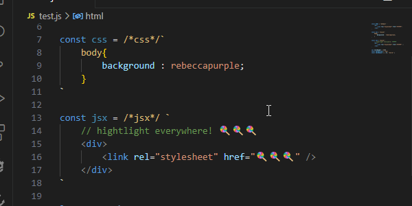
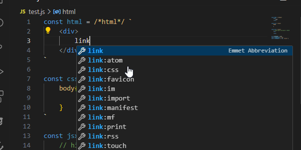
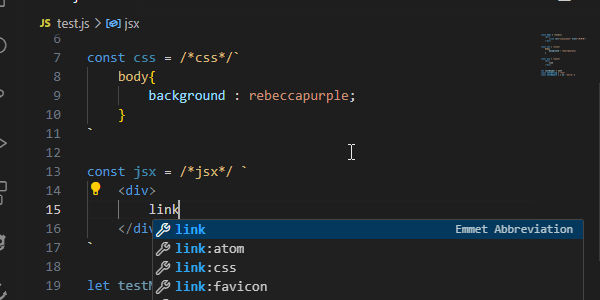
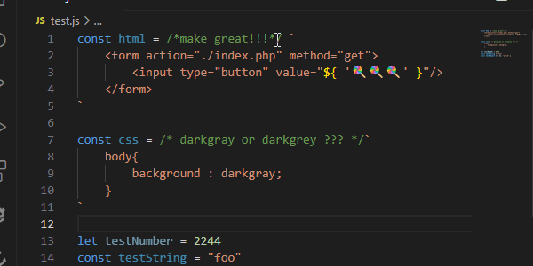
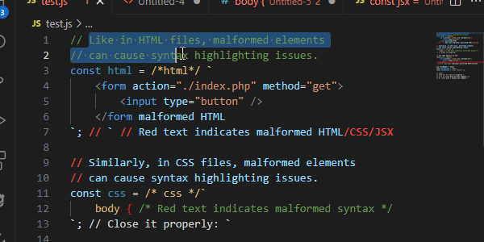

# Template Strings Kit

This plugin provides syntax highlighting, autocompletion, and diagnostics for template strings with prefixed comments such as `/*html*/`, `/*css*/`, and `/*jsx*/`.

## Features

### 🌈 Syntax Highlighting
Enjoy advanced syntax highlighting for template strings in JavaScript, supporting HTML, CSS, and JSX content.

### ✨ Autocompletion
Benefit from intelligent autocompletion inside your template strings. Whether you're writing HTML, CSS, or JSX, the appropriate suggestions will be provided.

### 🚨 Diagnostics for JSX
Get detailed error diagnostics for JSX code within your template strings, helping you quickly identify and fix issues as you type.

### ⚙️ Prefixed Comments Support
Automatically recognize template strings prefixed with `/*html*/`, `/*css*/`, or `/*jsx*/`, and apply the relevant features.

### Installation

1. Open VSCode.
2. Go to the Extensions view by clicking on the Extensions icon in the Sidebar.
3. Search for "Template Strings Kit" by savh and click Install.

### Usage

Open any `.js` file, and the plugin will automatically activate.
prefix a template string with `/*html*/`, `/*css*/` or `/*jsx*/` and done!

### Limitations
Malformed elements may _break your syntax highlighting_.
This issue _is common in many highlighters_ 
that handle embedded languages (but silently omitted) , 
such as styled components, lit elements, etc.
While it’s unlikely that this is intentional, 
you can prevent these issues by 
using comments in the embedded language, e.g : 

| embedded language  | comment        |
| -                  | -              |
| html               | `` <!-- --> `` |
| css                | `` // }     `` |
| jsx                | `` // </>   `` |

or by using JavaScript comments, e.g. : 

| embedded language  | comment        |
| -                  | -              |
| html               | `` // >`   ``  |
| css                | `` // }`   ``  |
| jsx                | `` // </>` ``  |

These are just examples, situations may vary.
You will practically never have to think about this, but it is still better to know. Just write clean code and you will be fine.

### About Me
I’m a versatile digital creator, offering a range of services from data entry to web development, illustration, and custom projects **on request**. Every task I take on is done with love and dedication, driven by a passion for helping others and making the digital world a better place. Your support fuels my creativity and empowers me to continue doing what I love. Together, we can create something amazing.

